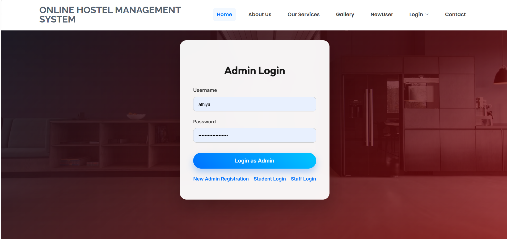
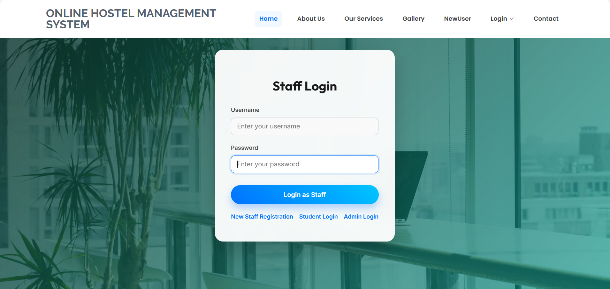
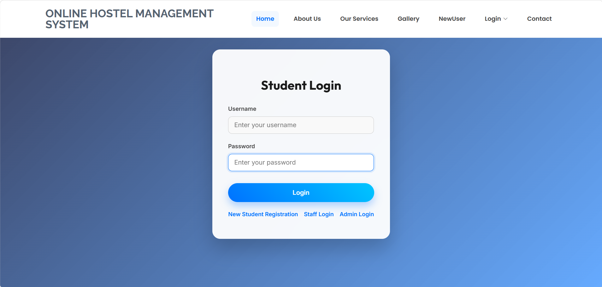

# Online Hostel Management System


> A state-of-the-art, full-stack MERN web application designed to automate and streamline hostel management operations with a premium, glassmorphism UI.

## 🌟 Project Overview
The **Online Hostel Management System** is a comprehensive solution built to handle the complex daily operations of student accommodations. Designed with a focus on **User Experience (UX)** and **Performance**, this application provides dedicated, secure portals for Administrators, Staff, and Students.

## 🚀 Key Features
- **Premium UI/UX**: State-of-the-art glassmorphism design, responsive layouts, dynamic panning gradients, and subtle micro-animations for an exceptional user experience.
- **Distinct Portals**: Unique, themed login portals for Admin (Dark/Crimson), Staff (Teal/Emerald), and Students (Ocean Blue).
- **Admin Dashboard**: Manage rooms, messes, staff, users, view reports, and allocate resources seamlessly using modern data grids.
- **Staff Operations**: View profiles, assigned duties, and comprehensive reports in a beautiful, responsive dashboard grid.
- **Student Portal**: View personal profiles, track room/mess allocations, and raise complaints quickly and efficiently.
- **Robust Authentication**: Secure, role-based access control ensuring data privacy across all user types.

## 📸 UI Showcase

### Home Page

*The landing page features a dynamic, panning gradient hero section and a clean overview of the system capabilities.*

### Admin Portal

*The Admin login portal utilizes a striking dark/crimson theme to establish authority and focus.*

### Staff Portal

*The Staff login portal features a professional teal/emerald theme, blending perfectly with the glassmorphism card.*

### Student Portal

*The Student login portal retains a vibrant, welcoming ocean blue theme.*

## 💻 Tech Stack
- **Frontend**: React.js, React Router, Axios, CSS (Custom Glassmorphism & Animations)
- **Backend**: Node.js, Express.js, RESTful APIs
- **Database**: MongoDB, Mongoose ODM

## ⚙️ How to Run Locally

### Prerequisites
- Node.js installed on your machine
- MongoDB running locally on port `27017`

### 1. Start the Backend Server
```bash
cd server
npm install
npm run server
```
*The server will start on `http://localhost:5000`.*

### 2. Start the Frontend Client
Open a new terminal window:
```bash
cd client
npm install
npm start
```
*The client will start on `http://localhost:3000`.*

